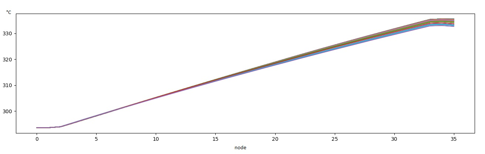

# CTF
Thermal-hydraulics and subchannel simulations

The purpose of the project is to generate a full-core subchannel model for a PWR; the python script "ctf_fullcore_01.py" creates the steady state case, the script "ctf_fullcore_02.py" the transient case. The data are written into the CTF template input file "KXX_SIM5_1-1-1_template" and "KXX_SIM5_1-1-1_template_transient" respectively. 

As an example a 3x3 fuel assembly "mini-core" model is generated. It has 36 six axial nodes and 2209 subchannels for a 16x16-20 FA type.

The radial layout and fuel assembly names is shown in figure 1:

The radial FA layout is shown in figure 2:

The schema of the axial FA layout is shown in figure 3:

The steady state results for the mass flow of fuel assembly FA 14 for every subchannel is shown in figure 4:

The steady state results for the pressure of fuel assembly FA 14 for every subchannel is shown in figure 5 as function of node:

The steady state results for the temperature of fuel assembly FA 14 for every subchannel is shown in figure 6 as a function of node:

The steady state results for the periphery gap cross flow of fuel assembly FA 14 for every subchannel is shown in figure 7 as a function of node:

