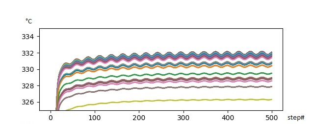

# CTF
Thermal-hydraulics and subchannel simulations

The purpose of the project is to generate a full-core subchannel model for a PWR; the python script "ctf_fullcore_01.py" creates the steady state case, the script "ctf_fullcore_02.py" the transient case. The data are written into the CTF template input file "KXX_SIM5_1-1-1_template" and "KXX_SIM5_1-1-1_template_transient" respectively. 

As an example a 3x3 fuel assembly "mini-core" model is generated. It has 36 six axial nodes and 2209 subchannels for a 16x16-20 FA type.

The radial layout and fuel assembly names is shown in figure 1:

The radial FA layout is shown in figure 2:

The schema of the axial FA layout is shown in figure 3a:

An example of the radial FA power factors is shown in figure 3b:

The steady state results for the mass flow of fuel assembly FA 14 for every subchannel is shown in figure 4:

The steady state results for the pressure of fuel assembly FA 14 for every subchannel is shown in figure 5 as function of node:

The steady state results for the temperature of fuel assembly FA 14 for every subchannel is shown in figure 6 as a function of node:

The steady state results for the periphery gap cross flow of fuel assembly FA 14 for every subchannel is shown in figure 7 as a function of node:

A sample transient calculation was done: 10% sinusoidal flow variation at the center fuel assembly FA 14. In figure 8 the inlet (top) and outlet  (bottom) mass flow is shown for all time steps: 0.06s per step. There are two channel groups: normal channels and channels with guide tubes (having low mass flow). 

It is obvious tha the outlet mass flow variation is much smaller than the inlet flow variation because of cross flow between the assemblies. However, the mass flow homogenisation happens very fast at a few bottom nodes. The outlet temperature variations are very small, as shown in figure 9.

